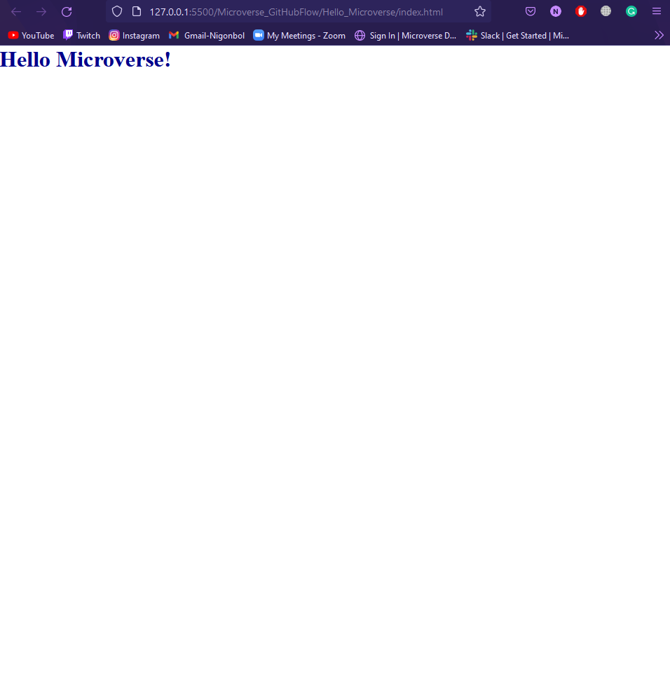

# Hello Microverse Project

>This is the first HTML and CSS project from the Microverse program Module 1 'The portal'

This project shows the way to implement all the basic developments tool.

## Built with

-HTML - CSS
-GIT/GITHUB

## Project Screenshot

## Authors

👤 **Nicolas Gonzalez**

-Github: [Github](https://github.com/Nicolaswg)
-LinkedIn: [LinkedIn](https://www.linkedin.com/in/nicolas-gonzalez-8623461a0/)

## 🤝 Contributing

Contributions, issues, and feature requests are welcome!

Feel free to check the [issues page](https://github.com/Nicolaswg/HelloMicroverse_project/issues)